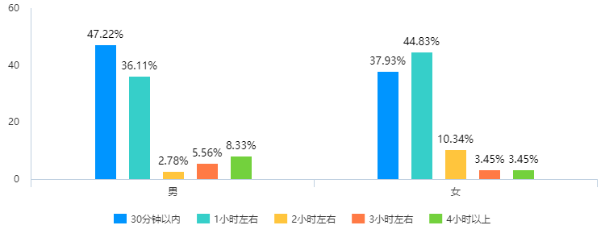

# 关于三班网络使用时长的报告

[TOC]

## 概述

还记得吗，我们在7月21日开展了一份“关于三班网络使用时长”的调查，同学们都填写了调查问卷，一段时间后我们《关于三班网络使用时长的报告》终于出炉啦！！！

这里包含了对同学们填写数据的统计、分析和对同学们的网络使用建议，快点看下去吧！

## 填写情况

我们的填写情况还是很不错的，凑够了61个人。不过截至制作报告时居然达65人填写，你们是认真的嘛？都说了不要重复填写了啦！

## 详细情况

### 第2题：通过什么接触了网络

统计圆环图如下：

.png)

可以看出涉猎范围之广泛，绝大部分人通过手机来接触网络，人数达58人

拥有智能手表的人数为11人，占比16.92%

### 第3题：通过什么方式接触网络

这个选题就很有意思了

.png)

如图：

使用父母手机的人处于压倒性优势，占比92%，人数60人！

还发现了有近50%的人拥有自己的上网设备

极少数人还使用了亲戚朋友的设备

令人欣慰的是，没有人使用同学的设备

### 第4题：使用网络的目的

.png)

从图中看来还是绝大多数人把网络用于学习，占比是惊人的97%，人数63（都超了啊喂，这就是不能重复填的原因）

其次是联系沟通

用来放松排在第三

有30%的人填写了“与同学聊天”，……有这时间学习累了听个歌放松一下它不香嘛(doge)

还有12%的人选择“打游戏、网上冲浪”，打游戏也可以理解，~~这个网上冲浪它在那里冲？~~ 

还好没有人网上交友，在奉劝一句：**不要网上交友！**

*还是建议大家不要到不健康的的网站、不阅读不适宜我们阅读的书籍，既耽误时间，还影响学习*

### 第5题：网络还用于哪些方面【隐藏,(4):其他触发】

有些同学看到这道题会有些陌生，~~啊！什么！我好像没做过这题？~~

这道题是给上一道多选题选择“其他”的同学一个自我发挥的空间

总共4位同学填写，最多的是”听歌“

啊这，上一题有“放松等休闲活动”这个选项啊，4个里面3个都为放松，其余一个为”查询资料，学习等“

### 第6题：接触网络多长时间了

”接触网络多长时间了“这道题指你从自己开始使用网络到现在有多久了(单位：年)

我觉得可能有同学没有理解题意，好多人填1年，要不是我限制只能填整数，还会给我整出个0.1

你们小学是怎么过的啊[捂脸]

.png)

平均数为4.03

多数人集中在<=4年内，相当于三年级左右接触网络

填14年的就过分了啊，还不止一个，你们一出生就会上网啦？(doge)(小朋友有许多问号啊)

要不是上限是14，怕不是要飞出去

### 第7题：每周使用网络时长

.png)

平均值为：6.97（单位：小时），也大概就是每天一小时

每周使用7小时内的竟有49人！~~你们真就人均爱好刷题呗，假期不看电视、不看网课、不玩游戏的嘛~~

### 第8题：每天使用网络、电子设备等，约多长时间

.png)

kb！**83%！**一小时左右向下以压倒性优势战胜其余部分！

额…我该说什么，两小时以上的同学抓紧加入大部队哈

### 第9题：使用最多的方面

.png)

如图：(除“其他“外排名)

还是照应前面的题，多数用于沟通联系的聊天软件位列第一，不要交网友！

排名第二的是用于休闲的音乐软件（希望你们能听点正常的歌）

第三为视频软件，追剧要控制时间，看经典的、正能量的哦！

游戏虽好玩，但要控制度哦

令人惊奇的是没有人去看直播！

### 第10题：你在使用这些软件的时候，会考虑充值吗【隐藏】

只有在第9题选择“斗鱼、虎牙等直播软件”或“王者荣耀等游戏软件”选项时，该题才会出现

填写人数28人

.png)

### 第11题：你使用最多的其他方面【隐藏】

只有在第9题选择“其他”选项时，该题才会出现

填写人数25人

.png)

千言万语汇成一个词，查资料！！！

对哦，我忘了设这个选项了[捂脸]

### 第12题：对于网络的看法，下列*<u>**错误**</u>*的是

注意审题！是错误的啊！！！（血压飙升）

这些还是从上下学期的期末考试真题中组出来的[捂脸]

.png)

不过真理还是掌握在多数人手中，不过还是不到一半

剩下的选项平分秋色

这题没答对怎么办，还不赶快学习去，下学期政治好好听！

## 番外 — 特殊发现

### 男女每天使用网络时长的对比

这一对比非常的amazing啊！

男女在“三十分钟以内”和”一小时左右“的结果正好相反，男生在三十分钟以内多，一小时左右少，而女生相反

在2~4小时的选项中也相反，男生使用网络时间长得多，女生相反

### 征集活动在无人督促下的提交情况

你们以为我的调查报告发出就不催了是因为我懒吗，其实这也在我的算计之中哒！^~~（其实就是因为懒）~~^

.png)

7月21日征集当天：已有一半左右的人完成（大部分为刚发出就完成的）

次日：有14%去想起完成

23日至24日：被群信息淹没、多数被遗忘，无人问津

……

27日：再次督促，完成率达98%

次日：有2%去想起完成

看着这个曲线是不是有些熟悉

艾宾浩斯直呼内行(doge)，同时也是18年数学期末中马老师提到的曲线(doge)

21日至24日、27至29日的曲线几乎和遗忘曲线完美贴合！

告诉我们，防止被人忘记的最好方法就是督促！防止忘记的最好方法就是复习！

同时也建议在群里要进行征集的同学，较紧张可以在早中晚饭点前三次进行督促，不紧张的可在中晚饭点前~次日中晚饭点前进行提醒哦

## 彩蛋

### 疫情期间别乱跑了哈 ---- IP也能定位的

### 你在迟疑！---- 用时我可是知道的哈

## 建议

1. 少看电子设备，隔半小时进行远眺窗外，摆些绿色植物
2. 可开防蓝光模式/护眼模式/夜间模式的尽量打开
3. 不要浏览不安全、不健康的网站
4. 设置较复杂的账号密码、不泄露账号密码
5. 网络不是法外之地，请勿发布不符合要求的信息
6. 不要在网上结交网友
7. 适度游戏、合理放松
8. 请勿相信涉及转账的未知电话短信

## 谢谢大家！

制卷：凯文

图表及统计：问卷星 www.wjx.com

文案：凯文

校对：凯文

本报告4036字、2422词、图表20张、用时近5小时

感谢大家的支持！